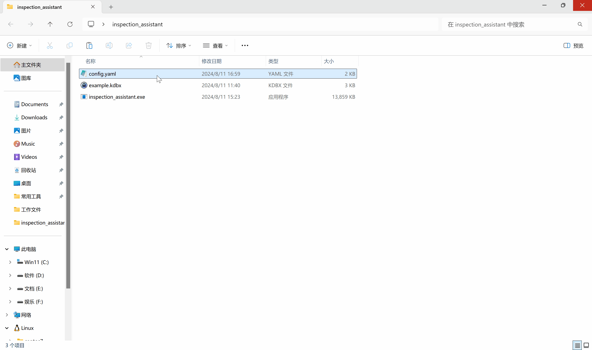

# inspection_assistant(巡检助手)

自用工具,目前实现了自动打开浏览器访问页面并填充用户密码

使用golang的chromedp库控制浏览器,

使用keepass的kdbx数据库加密保存url,用户,密码,

使用Keepass提供的powershell脚本调用keepass.exe反射API读取kdbx数据库

使用yaml作为配置文件格式,config.yaml中记录浏览器路径,keepass.exe和kdbx路径,web的entry_title和css选择器等

> 程序执行先从config.yaml配置中获取路径信息,然后要求输入keepass数据库密码,密码正确根据config中的entry_title从keepass数据库中查找url,用户,密码等信息,调用浏览器访问目标url,并根据config中的css选择器填充用户密码,默认不自动点击登录按钮

## 运行环境

* 系统Win10以上,此工具使用go1.22开发,go1.21以后不支持Win7

* Chrome或Chromium浏览器(使用chromedp,理论上支持Chrome DevTools Protocol的版本都可以)

* 此工具使用Windows的powershell脚本调用Keepass的反射API,需要安装Keepass

## 使用说明

1. 从github release下载打包好的压缩包并解压

2. 下载keepass并安装,创建自己的kdbx数据库 [官网下载](https://keepass.info/download.html)

3. 修改config.yaml配置文件,需要了解基础yaml语法
   
    * 修改browser_path为本地浏览器路径,

    * 修改browser_data为浏览器数据路径,

    * 修改keepass_path为keepass.exe路径,

    * 修改kpdb_path为创建的keepass数据库路径,后缀为kdbx,

    * 修改sites_info下的站点信息,sites_info为数组格式,

      * entry_title为keepass数据库中标题,

      * user_locator为用户名输入框的css选择器,

      * pass_locator为密码输入框的css选择器,

      * login_locator为登录按钮的css选择器,

      * 可选: auto_login,默认为false,需要自动点击登录按钮设置为true即可

      * 可选: pass_fill_locator,默认为空,在点击密码输入框后密码输入位置并不是当前输入框的特殊情况使用,值为新的输入框的css选择器

4. 运行inspection_assistant.exe,输入keepass数据库密码后自动打开浏览器填充密码,完成操作后自动退出

## 示例说明

配置文件config.yaml中记录了163邮箱,迅雷,考试宝,超星等四个站点的作为演示,

example.kdbx为示例keepass数据库,密码为password,

示例数据库中记录了以上几个网站的url,测试用户名,密码等信息

效果如下:

